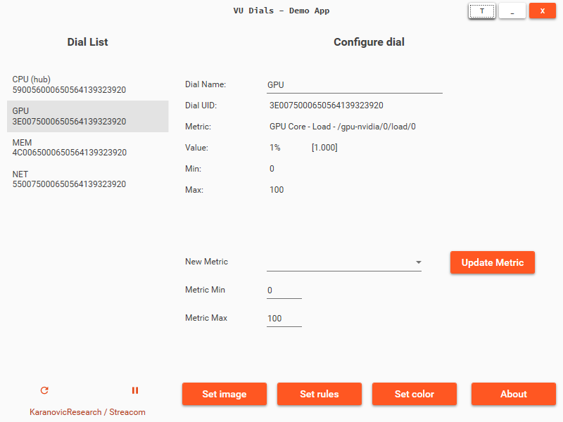
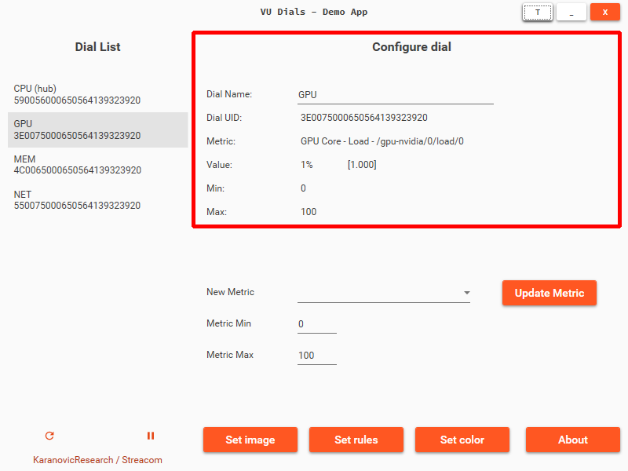
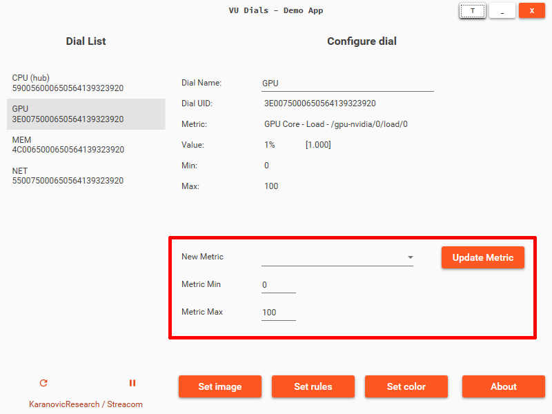
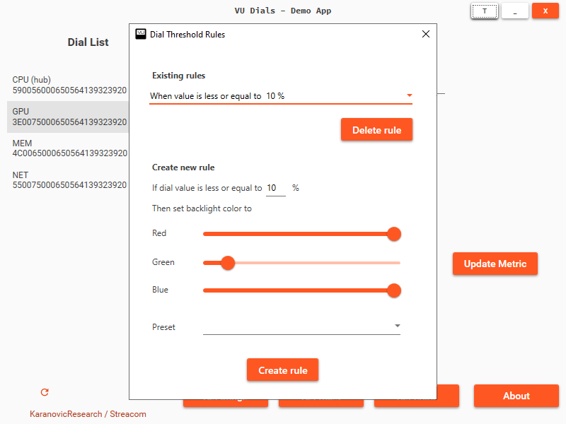

# VU1 Demo Application

<figure markdown>
  { width="800" }
  <figcaption>VU1 Demo Application</figcaption>
</figure>

[:fontawesome-solid-floppy-disk: Download page](https://vudials.com/download/demo_app){:target="_blank"} - [:fontawesome-brands-square-github: Source code](https://github.com/sasakaranovic/vu1-demo-app){:target="_blank"}

## Why the demo app?

VU dials can be used for many different applications. We can't wait to see all the creative applications of VU1 dials that VU dials community will inevitably come up with.

But at the time of release of VU1 dials there will be handful of applications that support VU1 dials.
Hopefully over time developers and the community will start integrating them into existing applications.

In the mean time, we have designed a simple demo application that allows you to use VU1 dials for PC resource monitoring.

## VU1 demo application

Demo application allows you to show PC usage information like:

- CPU core, CPU package, GPU, Memory, Network usage/load
- CPU core, CPU package, GPU, HDD, Motherboard temperature
- CPU, GPU power draw
- CPU, GPU clock speeds
- CPU, Motherboard voltage

!!! Note
    We use library provided by the awesome [LibreHardwareMonitor](https://github.com/LibreHardwareMonitor/LibreHardwareMonitor){:target="_blank"} project to retrieve sensor information.

## Dial information

<figure markdown>
  { width="800" }
  <figcaption>Dial information</figcaption>
</figure>

Select dial from the `Dial list` on the left.

The main window will update with the dial information.

| Cell | Description |
| :---- | : ----- |
| Dial Name | The name assigned to this dial. You can edit dial name and click `Update metric` to rename the dial |
| Dial UID | Unique identifier for selected dial |
| Metric | Shows what is the metric/sensor that this dial is displaying |
| Value | Shows dial value (scaled and in percent) and raw sensor value in brackets |
| Min | Scale minimum |
| Max | Scale maximum |

## Configure metric

<figure markdown>
  { width="800" }
  <figcaption>Configure metric</figcaption>
</figure>

1. Select the dial from the `Dial list` on the left.
2. Select the value you wish this dial to display from the `New metric` drop down
3. Adjust `Metric Min` and `Metric Max` if necessary.
4. Click `Update metric`

### Metric scaling

VU dials expect value that is in `[0-100]` range. However in reality sensor values can be way smaller ie. from `[0-1]` or much larger like `[0-250]`. So we obviously need to scale the real-world value to `[0-100]` range.

You can adjust the scaling of the sensor value to map whatever the min/max values are to dials `[0-100]` range.

For example let's say you want to show CPU power draw and the sensor value can go from `0W` to `250W`.
Let's say also that we really only want to focus on power draw above 50W so that (and any smaller) value should be mapped to `0%`.
We also want to map power draw of 250W (and above) as `100%`.

We would set the `Metric Min` to `50` and `Metric Max` to `250`.
The demo app will then scale the value of this sensor so that it maps `[50-250]` values down to VU dials `[0-100]` range.

## Update dial background image

You can update dial background image by clicking on `Set image` button.
The dial will open and you can select the image you wish to use for background image.

Image should be

- Size: `144 x 200px`
- Type: `PNG` / `JPG` / `JPEG`

## What are rules and why you should set them?

<figure markdown>
  { width="800" }
  <figcaption>Configure metric rules</figcaption>
</figure>

Demo app allows you to define mapping between dial value and backlight color.
In the demo app these are called `Rules`.

To illustrate how rules work, let's use a simple example where we have multiple rules defined:

- When value is less or equal to `10%` :fontawesome-solid-hand-point-right: Backlight is `Off`
- When value is less or equal to `30%` :fontawesome-solid-hand-point-right: Backlight is `Red`
- When value is less or equal to `50%` :fontawesome-solid-hand-point-right: Backlight is `Green`
- When value is less or equal to `70%` :fontawesome-solid-hand-point-right: Backlight is `Blue`

The demo app will apply the last rule that matches.
Which means if the dial value is `33%`, the dial backlight will be `Red`.
On the next cycle if value changes to `65%`, the dial backlight will be `Green`.
